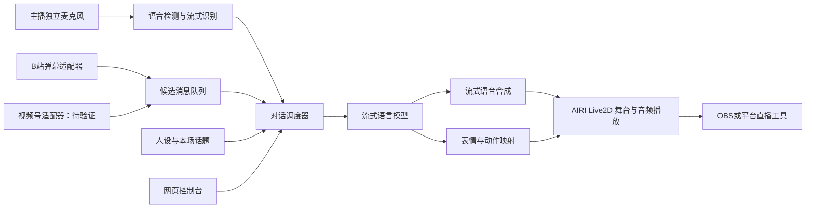

# AIRI Live2D AI 直播助播：项目基线

日期：2026-10-06。状态：技术路线与分阶段方案。开发起点见仓库 README，实际完成度见 STATUS.md。

## 已确认的目标

- 基于 AIRI，使用 Live2D 形象。
- 主播为用户本人，AI 是有稳定人设的助播，主要与主播自然互动，选择性参与弹幕。
- 面向哔哩哔哩、微信视频号；是否同时开播待确认。
- 不开发游戏操作能力。
- 项目要能在其他设备继续开发，代码、配置及项目进度不能只保存在某台电脑。

## 已确定的路线与待补资源

1. 云端开发与 AI 后端，直播设备负责麦克风、Live2D 渲染及推流。
2. 使用 `baian-666/ds-zhubo` 仓库，对话模型使用 DeepSeek。
3. 首版为聊天陪伴、知识分享。
4. 仍待提供：云服务器、Live2D 模型、每月预算、直播设备与麦克风/推流软件。

以下列出目标架构，不能据此认为所有模块已经实现或部署。

## 建议架构

采用云端开发、云端 AI 后端、直播设备负责音视频采集和最终画面的方式。这样开发设备可以更换，直播过程仍有直接可控的音视频链路。

图中为逻辑分工；语音检测可留在直播设备，识别、调度、生成与合成可放云端。AIRI 页面托管在云端不等于画面在服务器上渲染：浏览器端的 Live2D 通常仍消耗打开页面的设备资源。

### 云端开发与生产运行

- 代码：用户控制的 GitHub 仓库，保留 AIRI 上游关联，并固定经过验证的提交版本。
- 开发：GitHub Codespaces + devcontainer，浏览器即可恢复开发环境。Node/pnpm 版本按选定 AIRI 提交的配置锁定。
- 生产：独立云主机或容器服务运行网关、调度器、平台适配器及模型代理；不要将开发 Codespace 当作持续开播服务。
- 持久化：数据库保存人设、配置版本、场次摘要及必要记忆；对象存储保存模型与声音等大文件。前端浏览器存储不能作为跨设备同步的唯一来源。
- 项目交接：每次完成工作提交代码并推送；仓库记录当前状态、启动步骤、阻塞项和下一步。会话记录不能替代这些项目文件。
- 密钥：使用云平台或 Codespaces 的 secrets，模型 API 密钥不进入前端包和 Git；OBS 舞台使用限定权限的访问凭据。

Codespaces 可从浏览器访问，但会因空闲停止；未推送的工作也不能替代 Git 备份。[官方说明](https://docs.github.com/en/codespaces/about-codespaces/deep-dive)

### 完全云端渲染的备选

如果用户要求所有渲染和推流都在云端，增加云端图形运行环境、音视频上行、编码、远程音频设备和平台登录维护。先做画面帧率、往返延迟和断线恢复验证，再选实例；第一版不预设购买 GPU。

即使采用此方案，主播设备仍需把麦克风和可能的摄像头画面传到云端。具体推流方式取决于两平台账号实际开放的功能。

## AIRI 的复用边界

AIRI 官方文档列出网页舞台、Live2D、语音能力及服务通道，适合作为角色呈现基础。[项目概览](https://airi.moeru.ai/docs/zh-Hans/docs/overview/)

拟复用 `apps/stage-web`、`packages/stage-ui-live2d` 与相关音频能力。对话调度、平台接入、跨设备配置放到独立服务，并通过 AIRI 适配层连接。具体输入、取消、播放反馈和表情接口需按固定提交验证，不能假设现有 SDK 已完整覆盖直播需求。[server-sdk](https://raw.githubusercontent.com/moeru-ai/airi/main/packages/server-sdk/README.md)

查询到的 `airi-plugin-bilibili-laplace/src/index.ts` 仅含 WIP 提示，不能当作开箱即用的 B 站接入实现。[源码](https://raw.githubusercontent.com/moeru-ai/airi/main/plugins/airi-plugin-bilibili-laplace/src/index.ts)

## 自然互动的关键设计

### 发言调度

采用显式状态：聆听、准备回复、正在说话、被打断、静音。语言模型生成内容，调度器决定是否允许播放。

- 主播明确叫 AI、提问或交棒时优先回应。
- 主播连续讲述时默认聆听，用表情反馈；语音检测到停顿并不自动等于可以接话。
- 同时考虑语音结束、句意、称呼、本场话题与近期发言频率，判断是否该接话。
- 主播开口时可立即压低或停止 AI 声音；区分简短附和与真正接管话轮，保留按键强制打断。
- 真正打断后取消生成和 TTS，清空待播放音频；用话轮版本号丢弃迟到结果，避免旧回答重新出声。
- 保存实际播放到的位置，避免后续以为已经说完一段未播出的内容。
- 空场时可以短句补充或追问，但设置冷却时间和每分钟发言预算。

初始参数仅作测试起点：停顿观察 600–1000 毫秒、单次 1–2 句、弹幕回复最多每 15–30 秒一次、同一观众 60 秒冷却、候选消息约 20 秒过期。实际值依内容和说话速度调整。

### 选择性弹幕互动

弹幕先经过规范化、去重、限流、话题相关性和可回答性评估，再进入有限队列。优先考虑主播点选、直接叫 AI、与正在讨论内容相关、值得展开的消息。

队列保留平台、场次、消息标识和接收时间；断线重连去重，不补读大量旧消息。两个平台的人气差异不能使一方永久失去被选中的机会。默认只口头回应，不自动发平台文字消息。

观众文字作为待讨论内容处理，不得覆盖系统人设、触发任意工具或索取密钥。回复前检查是否值得公开播报，避免原样念出不适合直播的内容。

### 人设、声音与音频路由

人设不仅包含称呼和口头禅，还需要助播与主播的关系、可开玩笑范围、回答长度、主动程度和承认不确定的方式。目标是形成自己的角色，而不是承诺复制 Neuro 的整体体验。

对话生成已确定使用 DeepSeek。中文流式识别和语音合成供应商仍待选择；根据中文口语、首包延迟、声音表现和实际费用验证效果，不一开始自训模型。

主播麦克风与 AI 输出分轨，给识别系统的输入尽量不包含 AI 回放、BGM 和直播回声。表情由有限的情绪标签驱动，最终映射到具体 Live2D 模型提供的参数；口型与实际音频同步。需要核对模型及声音的直播使用授权。

## 平台落地

| 平台 | 当前证据与实施路径 | 未解决项 |
|---|---|---|
| B站 | 官方直播开放平台提供互动接入路线，先完成账号、应用及主播授权验证，再开发弹幕适配器 | 用户的开发者/应用资格、身份码及实际事件权限 |
| 微信视频号 | 当前调研未核实到可直接用于本项目的通用实时直播评论接口；先验证账号工具与授权服务能力 | 可用评论来源、延迟、稳定性、账号推流功能 |

B 站官方示例涉及开发者凭据、应用 ID 和主播身份码，不能只填房间号就假定完成授权。[官方示例](https://github.com/bilibili-openplatform/OpenLive_CSharpDemo/blob/main/README.md)

视频号即使暂时没有自动评论来源，也可先验证 AI 画面和声音随主播一起播出，并通过控制台手动选入观众问题；这只是临时路径，不算视频号自动弹幕能力已完成。当前“没有核实到接口”不等于断言平台绝无此能力。

## 分阶段交付与验收

| 阶段 | 交付物 | 验收条件 |
|---|---|---|
| 0：云端基础 | 远程仓库、固定 AIRI 版本、开发容器、项目状态文件 | 第二台设备可以恢复环境、运行舞台并继续提交 |
| 1：主播语音闭环 | 麦克风→识别→回复→语音→Live2D，静音与打断 | 连续对话 30 分钟；不会持续听见自己并自答；打断后旧音频不复播 |
| 2：自然话轮 | 状态机、人设、短句、附和、冷场策略、发言预算 | 20 组演练覆盖长讲述、叫名、附和、沉默及抢话，主播可随时收回话轮 |
| 3：B站弹幕 | 官方接入、筛选、去重、控制台点选 | 模拟弹幕高峰及重连，不抢主播、不连续读屏、不补读过期消息 |
| 4：视频号验证 | 确认评论来源并实现适配器，测试推流组合 | 真实账号演练确认评论到达与音视频播放；否则明确标为未完成 |
| 5：直播稳定性 | 云部署、持久化、故障恢复、指标、配置备份 | 两小时试播、换设备操作、模型超时和平台断线恢复 |

建议性能目标（尚未实测或承诺）：从主播说完到 AI 首段声音，P50 不高于 1.5 秒、P95 不高于 3 秒；真正打断触发后到本地播放停止不高于 300 毫秒。分别记录语音分段、识别、调度、模型首 token、TTS 首音频和播放缓冲的耗时。

## 下一次开发入口

仓库已确定。下一步在真实 Codespace 验证配置与 DeepSeek 调用 → 完成 AIRI 安装和舞台启动 → 选择识别/TTS → 连接可取消的语音话轮 → 验证换设备继续开发。之后扩展两个平台的真实弹幕。

预算应分成开发环境、常驻服务、模型调用、音频调用、存储带宽和可选云端渲染。当前缺少每日直播时长与服务选型，不给未经核实的价格承诺。
